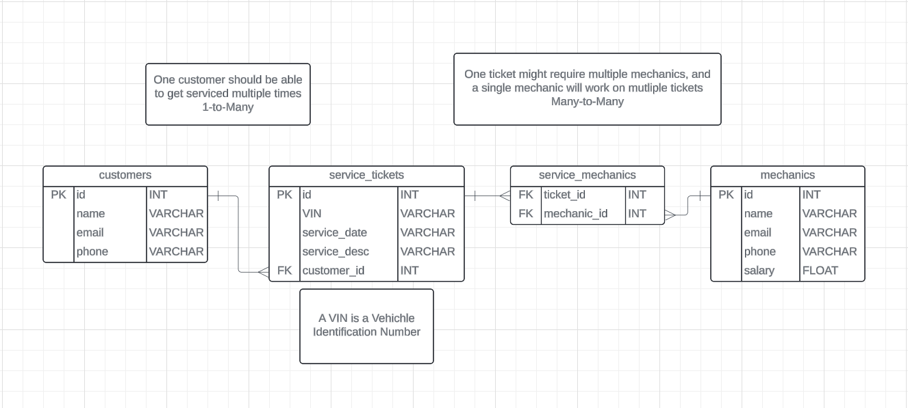

# 🔧 Mechanic Shop API

A RESTful API for managing automotive repair shop operations — customers, mechanics, vehicles, and service tickets.

**🔗 [Live API](https://mechanic-shop-api-yq4k.onrender.com/)**



## Features
- 🚗 Full CRUD operations for customers, vehicles, mechanics, and service tickets
- 🔐 Input validation and error handling
- 📊 Normalized relational database with proper entity relationships
- ✅ Automated testing with GitHub Actions CI/CD
- 📬 Postman collection included for easy API testing
- 🖥️ React frontend for interacting with the API

## Tech Stack
| Backend | Database | Testing | Deployment |
|---------|----------|---------|------------|
| Python | PostgreSQL | Pytest | Render |
| Flask | SQLAlchemy | GitHub Actions | |
| RESTful API | | | |

## API Endpoints

| Method | Endpoint | Description |
|--------|----------|-------------|
| GET | `/customers` | List all customers |
| POST | `/customers` | Create new customer |
| GET | `/customers/<id>` | Get customer by ID |
| PUT | `/customers/<id>` | Update customer |
| DELETE | `/customers/<id>` | Delete customer |
| GET | `/mechanics` | List all mechanics |
| POST | `/mechanics` | Create new mechanic |
| GET | `/vehicles` | List all vehicles |
| POST | `/vehicles` | Create new vehicle |
| GET | `/service-tickets` | List all service tickets |
| POST | `/service-tickets` | Create service ticket |

> 📬 For full endpoint documentation, import `2_Mechanic Shop API.postman_collection.json` into Postman.

## Getting Started

### Prerequisites
- Python 3.10+
- PostgreSQL

### Installation
```bash
# Clone the repo
git clone https://github.com/charlie7estrada/Mechanic_Shop_API.git
cd Mechanic_Shop_API

# Create virtual environment
python -m venv venv
source venv/bin/activate  # On Windows: venv\Scripts\activate

# Install dependencies
pip install -r requirements.txt

# Set up environment variables
cp .env.example .env  # Then edit with your database credentials

# Run the app
flask run
```

### Running Tests
```bash
pytest tests/
```

## API Documentation

Import the Postman collection for complete API documentation:

1. Open Postman
2. Click **Import**
3. Select `2_Mechanic Shop API.postman_collection.json`
4. Start testing endpoints!

## Contact

Charlie Estrada — [GitHub](https://github.com/charlie7estrada)
